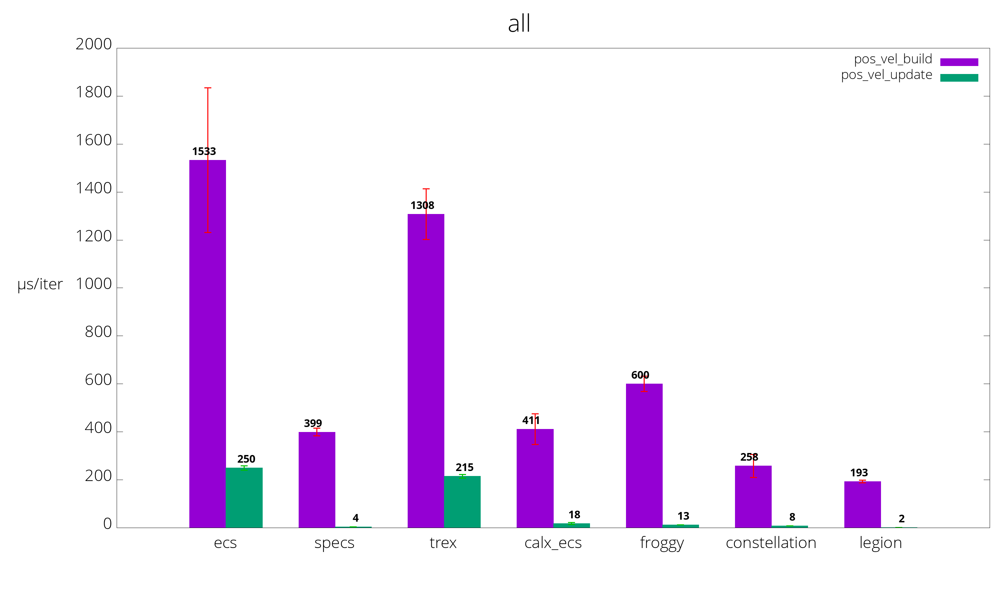

Legion aims to be a feature rich high performance ECS library for Rust game projects with minimal boilerplate.

# Benchmarks

Based on the [ecs_bench](https://github.com/lschmierer/ecs_bench) project.



# Getting Started

```rust
use legion::*;

// Define our entity data types
#[derive(Clone, Copy, Debug, PartialEq)]
struct Position {
    x: f32,
    y: f32,
}

#[derive(Clone, Copy, Debug, PartialEq)]
struct Velocity {
    dx: f32,
    dy: f32,
}

#[derive(Clone, Copy, Debug, PartialEq)]
struct Model(usize);

#[derive(Clone, Copy, Debug, PartialEq)]
struct Static;

// Create a world to store our entities
let universe = Universe::new(None);
let mut world = universe.create_world();

// Create entities with `Position` and `Velocity` data
world.insert_from(
    (),
    (0..999).map(|_| (Position { x: 0.0, y: 0.0 }, Velocity { dx: 0.0, dy: 0.0 }))
);

// Create entities with `Position` data and a shared `Model` data, tagged as `Static`
// Shared data values are shared across many entities,
// and enable further batch processing and filtering use cases
world.insert_from(
    (Model(5), Static),
    (0..999).map(|_| (Position { x: 0.0, y: 0.0 },))
);

// Create a query which finds all `Position` and `Velocity` components
let query = <(Write<Position>, Read<Velocity>)>::query();

// Iterate through all entities that match the query in the world
for (pos, vel) in query.iter(&world) {
    pos.x += vel.dx;
    pos.y += vel.dy;
}
```

# Features

Legion aims to be a more complete game-ready ECS than many of its predecessors.

## Advanced Query Filters

The query API can do much more than pull entity data out of the world.

```rust
// *Additional data type filters*
// It is possible to specify that entities must contain data beyond that being fetched
let query = Read::<Position>::query()
    .filter(entity_data::<Velocity>());
for position in query.iter(&world) {
    // these entities also have `Velocity`
}

// *Filter boolean operations*
// Filters can be combined with boolean operators
let query = Read::<Position>::query()
    .filter(shared_data::<Static>() | !entity_data::<Velocity>());
for position in query.iter(&world) {
    // these entities are also either marked as `Static`, or do *not* have a `Velocity`
}

// *Filter by shared data value*
// Filters can filter by specific shared data values
let query = Read::<Position>::query()
    .filter(shared_data_value(&Model(3)));
for position in query.iter(&world) {
    // these entities all have shared data value `Model(3)`
}

// *Change detection*
// Queries can perform coarse-grained change detection, rejecting entities who's data
// has not changed since the last time the query was iterated.
let query = <(Read<Position>, Shared<Model>)>::query()
    .filter(changed::<Position>());
for (pos, model) in query.iter(&world) {
    // entities who have changed position
}
```

## Content Streaming

Entities can be loaded and initialized in a background `World` on separate threads and then
when ready, merged into the main `World` near instantaneously.

```
let universe = Universe::new(None);
let mut world_a = universe.create_world();
let mut world_b = universe.create_world();

// Merge all entities from `world_b` into `world_a`
// Entity IDs are guarenteed to be unique across worlds and will
// remain unchanged across the merge.
world_a.merge(world_b);
```